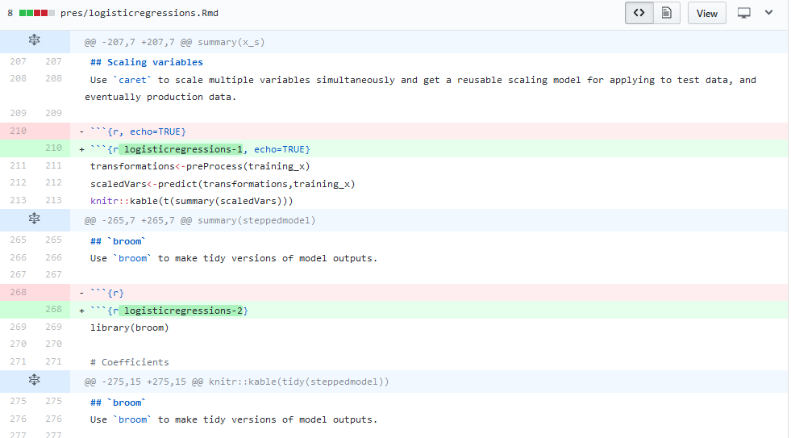

# namer

[](http://www.repostatus.org/#wip) [](https://travis-ci.org/lockedata/namer) [](https://coveralls.io/r/lockedata/namer?branch=master)


The goal of namer is to name the chunks of R Markdown files. It's your safety net when you've (willingly) forgotten to name most chunks of all R Markdown files in a folder. `namer` does *not* give meaningful labels to your chunks, but it gives them labels that won't change depending on their position like the automatic `knitr:::unnamed_chunk` function does when knitting. So you can e.g. shuffle your chunks and not loose their cache, or more easily debug over a whole folder!

For context about _why_ you should name your R Markdown chunks, read [this blog post](https://masalmon.eu/2017/08/08/chunkpets/).

The screenshot below is [a real life example](https://github.com/lockedata/pres-datascience/pull/1), result of running `namer::name_dir_chunks("pres")`.

[](https://github.com/lockedata/pres-datascience/pull/1/files)

## Installation

Install the dev version from this repo using:

``` r
remotes::install_github("lockedata/namer")
```

## Use

This is a basic example which shows you how to solve a common problem. The "test" folder first contains R Markdown files with unnamed chunks. After running `name_dir_chunks`, they're all named, with names using the filenames as basis.

``` r
fs::dir_copy(system.file("examples", package = "namer"),
            "test")
name_dir_chunks("test")
file.edit("test/example1.Rmd")
```

There's also `name_chunks` for use on a single R Markdown file; and `unname_all_chunks` to unname all chunks of a single R Markdown file which can be useful when cleaning your chunk labels.

**When using `namer`, please check the edits before pushing them to your code base. Such automatic chunk labelling is best paired with [version control](http://happygitwithr.com/).**

## Contributing

Wanna report a bug or suggest a feature? Great stuff! For more information on how to contribute check out [our contributing guide](.github/CONTRIBUTING.md). 

 Please note that this R package is released with a [Contributor Code of Conduct](CODE_OF_CONDUCT.md). By participating in this package project you agree to abide by its terms.
